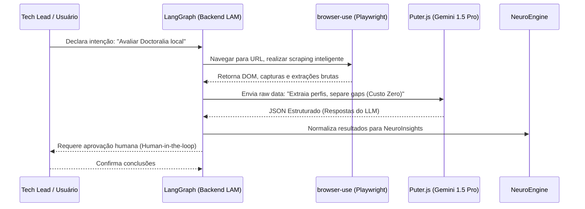

# Arquitetura do NeuroStrategy OS

O NeuroStrategy OS é estruturado em 4 pilares centrais que garantem inteligência profunda, custo zero em produção e navegação autônoma avançada.

## 1. Backend LAM (Large Action Model)
Orquestrador centralizado que permite que a IA tome decisões, planeje ações e interaja com o mundo web.
- **Núcleo:** Python e/ou Node.js.
- **Orquestração:** **LangGraph**. Fornece memória persistente (estado) e fluxos cíclicos essenciais para o raciocínio do agente. Integra *Human-in-the-loop* obrigatoriamente para aprovação de ações críticas ou decisões que impactem os dados do cliente.
- **Braço Executor:** **browser-use (Playwright)**. Responsável por toda interação, automação, web scraping e navegação furtiva nas plataformas essenciais (Doctoralia, Google Ads, GEO, WordPress).

## 2. Frontend IA-Híbrida
A camada de apresentação, focada em performance e inferência híbrida.
- **Interface:** React/Next.js otimizada e nativa de IA.
- **Custo Zero & Eficiência:**
  - Chamadas de inferência pesada (contexto longo, text-generation primário) são roteadas para o **Puter.js (Gemini 1.5 Pro free)**.
  - Processamento local (visão computacional no lado do cliente, extração rápida e embeddings leves) utiliza **Transformers.js (WASM)** e aceleração gráfica do navegador via **Browser-AI (WebGPU)**.

## 3. NeuroEngine (Dados Canônicos)
A espinha dorsal de inteligência do sistema. Não interage com o usuário, mas processa o que o agente coleta.
- Este modelo central normaliza e estrutura o oceano de dados brutos provenientes da web e do `browser-use`.
- A saída deste pilar são os **NeuroInsights**: relatórios analíticos focados em Propósito, Risco, Oportunidade e Tendência (Priority, Risk, Opportunity, Trend).

## 4. Intention Intelligence
O protocolo de comunicação humano-IA que impulsiona todo o sistema.
- **Interação Natural:** O usuário (Dr. Victor) dita ou escreve sua intenção no chat principal.
- **Resolução de Intenção:** O LAM capta essa intenção, decompõe abstratamente em tarefas atômicas e converte-as em planos de ação web do ciclo contínuo: **Planejamento -> Execução -> Verificação**.

---

### Diagrama: Interação LangGraph (LAM) e Puter.js
Abaixo, um exemplo de como o LangGraph (orquestrador local) interage com o Puter.js e com a web.

